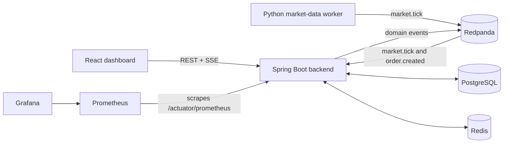

# LedgerStream

[](https://github.com/rehani1/LedgerStream/actions/workflows/ci.yml)

**Real-Time Paper Trading & Risk Platform**

LedgerStream is a deployed event-driven paper-trading platform that ingests replayed market data, streams quotes, accepts authenticated idempotent paper orders, settles fills through an append-only ledger, calculates portfolio risk, and exposes production-style tests, metrics, logs, and deployment artifacts.

First-screen engineering signals:

- Event-driven Spring Boot backend with Redpanda/Kafka-compatible topics.
- Real-time market data path from deterministic Python replay to Redis, PostgreSQL, and SSE clients.
- Idempotent order API using `Idempotency-Key` and `orders(user_id, idempotency_key)`.
- Append-only portfolio ledger for cash and position mutations.
- PostgreSQL source of truth, Redis latest quote cache, Redpanda event stream.
- Backend, frontend, worker, integration, E2E, and k6 load-test coverage.
- Prometheus metrics, structured request logs, and provisioned Grafana dashboard.
- Public Vercel + Render deployment backed by Neon, Upstash, and Redpanda Cloud.

## Live Demo

| Component | Link |
| --- | --- |
| Frontend | <https://ledger-stream.vercel.app/> |
| Backend | <https://ledgerstream-backend-5rk9.onrender.com/> |
| Backend health | <https://ledgerstream-backend-5rk9.onrender.com/actuator/health> |

Demo credentials: no shared public credentials are committed. Use local demo seeding for scripted demos, or register a temporary account once the deployed frontend is rebuilt with the final backend URL and Render CORS allows the Vercel origin.

Demo video: placeholder until a 60-90 second walkthrough is recorded.

Current public deployment notes are tracked in [Deployment](docs/deployment.md) and [Demo Script](docs/demo-script.md). On June 28, 2026, Render health returned `UP`; direct backend auth, symbols, portfolio, positions, and ledger reads worked. Browser API calls still require Vercel `VITE_API_BASE_URL=https://ledgerstream-backend-5rk9.onrender.com` and Render `BACKEND_CORS_ALLOWED_ORIGINS=https://ledger-stream.vercel.app`. Quote and fill demos require a hosted market-data producer publishing `market.tick` events.

## Architecture



Detailed system design: [Architecture](docs/architecture.md)

## Core Features

- JWT authentication with refresh-token rotation and logout.
- Role-based access control with admin-only replay controls.
- Symbol and quote APIs with Redis hot-cache reads and PostgreSQL fallback.
- Authenticated SSE quote streaming.
- Deterministic CSV market replay through a Python worker.
- Kafka-compatible JSON event contracts for `market.tick`, `order.created`, `order.filled`, `portfolio.updated`, `risk.updated`, and `audit.event`.
- Idempotent paper-order creation, user-scoped order history, and cancellation for pending orders.
- Market order simulation with explicit rejection reasons for missing quotes, insufficient cash, insufficient shares, and missing portfolio state.
- Transactional fill settlement that updates cash, positions, ledger entries, and risk snapshots.
- Portfolio summary, positions, ledger, latest risk, and risk history APIs.
- Structured JSON logs, request IDs, Prometheus metrics, and Grafana provisioning.

## Tech Stack

| Layer | Technology |
| --- | --- |
| Frontend | React, TypeScript, Vite, TanStack Query, React Router, Recharts, Vitest, Playwright |
| Backend | Java 21, Spring Boot 3, Spring Security, Spring Data JPA, Spring Kafka, Flyway, Actuator, Micrometer |
| Worker | Python, Pydantic, `confluent-kafka`, pytest |
| Data | PostgreSQL, Redis, Redpanda/Kafka-compatible topics |
| Infra | Docker Compose, Prometheus, Grafana, GitHub Actions, Dependabot, Vercel, Render, Neon, Upstash, Redpanda Cloud |
| Testing | JUnit 5, Mockito, Testcontainers, React Testing Library, Playwright, k6 |

## Data Model Summary

LedgerStream models paper trading with explicit accounting boundaries:

- `users` and `refresh_tokens` store authentication state.
- `symbols` and `price_ticks` store supported instruments and market data history.
- `portfolios`, `positions`, `orders`, and `fills` store trading state.
- `ledger_entries` is append-only and records cash and quantity deltas.
- `risk_snapshots` stores portfolio exposure and P&L snapshots.
- `audit_events` records security and trading actions with safe metadata.

Full schema and constraints: [Data Model](docs/data-model.md)

## API Docs

API reference: [API](docs/api.md)

Implemented groups:

- Auth: register, login, refresh, logout, current user.
- Symbols and quotes: symbol catalog, latest quote, history, quote stream.
- Orders: create, list, get, cancel.
- Portfolio: summary, positions, ledger.
- Risk: latest snapshot and history.
- Admin: replay status/start/stop and queue health.
- Observability: health and Prometheus metrics.

## Testing Summary

Most recent local verification on June 28, 2026:

| Area | Result |
| --- | ---: |
| Backend Maven tests | 126 passed |
| Frontend Vitest tests | 14 passed |
| Market-data worker pytest | 15 passed |
| Frontend production build | Passed with existing Vite chunk-size warning |

Additional coverage:

- Backend unit tests cover fill settlement, average cost, realized P&L, idempotency, rejection paths, risk calculations, access control, and controller behavior.
- Backend integration tests use Testcontainers for PostgreSQL and Redis when Docker is available.
- Frontend tests cover auth, dashboard, orders, portfolio, risk, and admin views with mocked APIs.
- Playwright E2E covers the browser trading flow with mocked APIs by default and can target a seeded local stack.
- k6 scripts cover order creation and quote API load paths.

## Performance Results

Measured low-load local Docker Compose baseline on June 28, 2026:

| Metric | Result |
| --- | ---: |
| Order creation p95 latency | 82.52 ms |
| Quote API p95 latency | 101.86 ms |
| Order creation throughput | 0.96 requests/sec |
| Quote API throughput | 4.84 requests/sec |
| API error rate under k6 load | 0.00% |
| Worker replay | 25 ticks consumed, 0 failed |

These are local baseline measurements, not production capacity claims. Details and commands: [Performance](docs/performance.md)

## Observability

The backend exposes `/actuator/health` and `/actuator/prometheus`. Custom metrics include market tick consumption/failures, order created/filled/rejected counts, quote stream clients/events/failures, quote cache hits/misses, and portfolio calculation latency.

Grafana provisioning lives under `infra/grafana/provisioning` and includes the `LedgerStream Overview` dashboard. Screenshot placeholder: `docs/assets/observability/grafana-ledgerstream-overview.png`.

Observability guide: [Observability](docs/observability.md)

## Deployment Architecture

| Layer | Provider |
| --- | --- |
| Frontend | Vercel |
| Backend | Render Docker Web Service |
| PostgreSQL | Neon |
| Redis | Upstash Redis |
| Event stream | Redpanda Cloud |

Local development keeps the same service boundaries through Docker Compose with PostgreSQL, Redis, Redpanda, Prometheus, Grafana, backend, frontend, and an optional worker profile.

Deployment guide: [Deployment](docs/deployment.md)

## Security Considerations

- Paper trading only; there is no real brokerage order-placement path.
- BCrypt password hashing.
- JWT access tokens and opaque refresh tokens hashed at rest.
- Refresh-token rotation and logout revocation.
- User-scoped repository queries for orders, portfolio, positions, ledger, and risk.
- Admin endpoints require `ADMIN`.
- CORS is environment-driven and must use exact frontend origins.
- Request logs omit bodies, query strings, authorization headers, cookies, passwords, access tokens, refresh tokens, API keys, and raw client IPs.
- Dependabot and Dependency Review cover Maven, npm, and Python dependency changes.

Security details: [Security](docs/security.md)

## Tradeoffs And Limitations

- Public browser trading still depends on final Vercel API-base rebuild and Render CORS alignment.
- Hosted quote/order-fill demos require a running market-data producer for Redpanda Cloud.
- Kafka publishes are not backed by an outbox table yet.
- SSE subscription state is in memory; multi-instance deployment needs sticky routing or shared fanout.
- Rate limits are in-memory per backend instance; Redis-backed distributed limits are future work.
- Limit orders can be accepted as pending, but matching is future work.
- Refresh tokens are stored in browser `sessionStorage` for the MVP; HttpOnly cookies are the preferred production improvement.
- Grafana screenshots and a 60-90 second demo video are placeholders until captured.

## Local Setup

Start the full local stack:

```bash
docker compose up --build
```

Start the optional market-data worker:

```bash
docker compose --profile worker up --build market-data-worker
```

Run backend tests:

```bash
cd backend
./mvnw test
```

Run frontend checks:

```bash
cd frontend
npm install
npm run test:ci
npm run build
```

Run worker tests and dry-run replay:

```bash
cd workers/market-data
python3 -m venv .venv
. .venv/bin/activate
pip install -r requirements.txt
PYTHONPATH=src pytest
PYTHONPATH=src python -m ledgerstream_market_data replay --file data/sample_ticks.csv --dry-run
```

Local demo seed is disabled by default. Enable it only for local or demo environments with `DEMO_SEED_ENABLED=true` and provider/local environment variables for demo credentials.

## Future Work

- Deploy or schedule a hosted market-data worker for Redpanda Cloud.
- Add broker-backed end-to-end event-flow tests.
- Add an outbox or transactional messaging layer.
- Add dead-letter topics and retry handling.
- Add limit-order matching.
- Add historical portfolio snapshots.
- Add a simple backtesting service.
- Add archive export paths.
- Move refresh tokens to `Secure`, `HttpOnly`, `SameSite` cookies.
- Capture Grafana screenshots and a short demo video.
