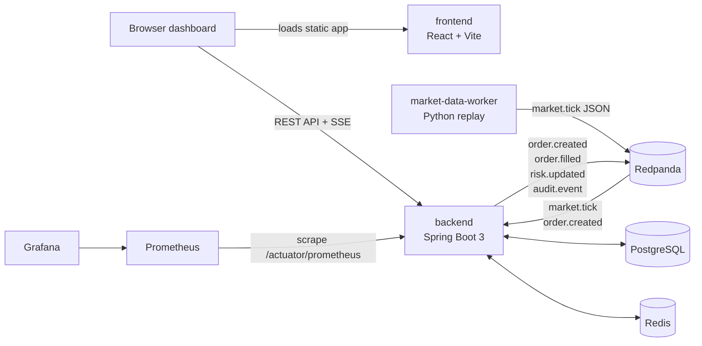
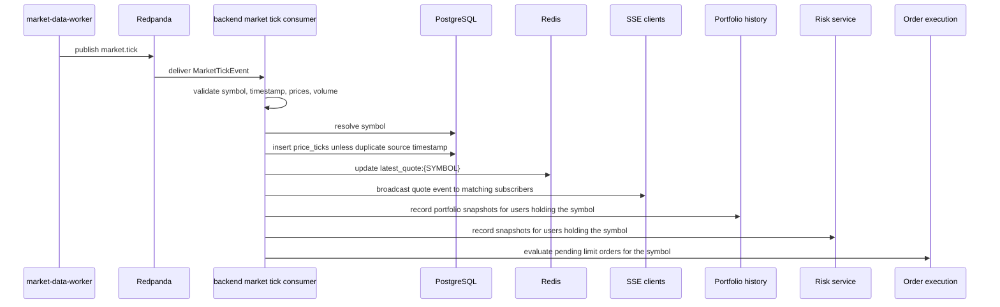
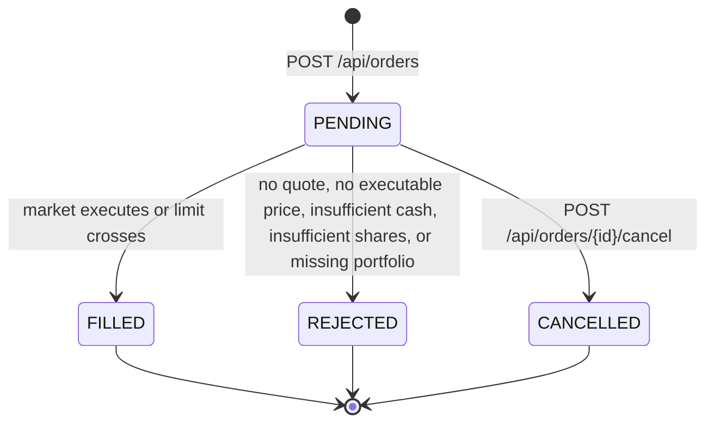
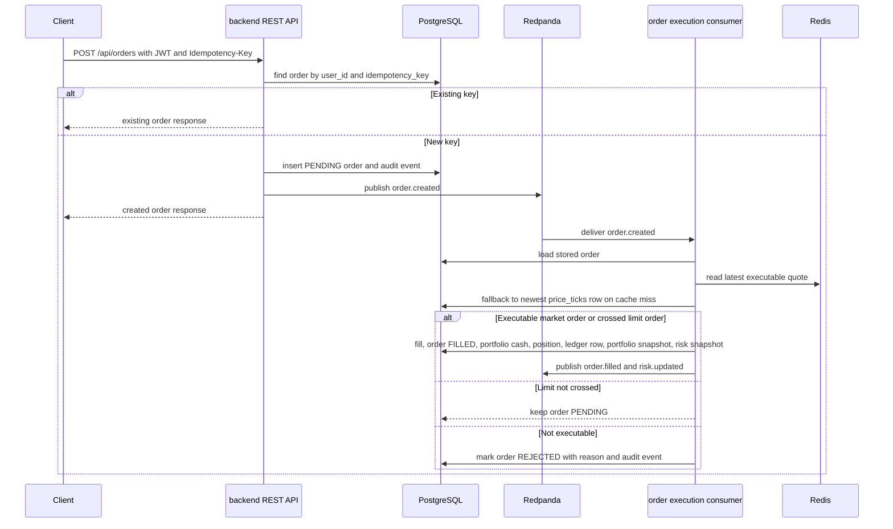

# Architecture

## Overview

LedgerStream is an event-driven paper-trading system. Deterministic market data enters through a Python replay worker, moves through Redpanda, and is consumed by the Spring Boot backend for historical storage, hot quote cache updates, quote streaming, market and limit order execution, portfolio accounting, portfolio snapshots, risk snapshots, and audit logging.

The system intentionally models paper trading only. There is no real brokerage order placement path, and all financial mutations are scoped to authenticated LedgerStream users.

## System Topology

## Service Responsibilities

| Service | Runtime responsibility |
| --- | --- |
| `frontend` | Authenticated React dashboard for quotes, streaming prices, order entry, order history, portfolio, ledger, risk, and admin replay controls. |
| `backend` | REST API, JWT and refresh-token auth, RBAC, SSE gateway, quote queries, order submission, market and limit execution, portfolio ledger settlement, portfolio history, risk calculations, structured logs, metrics, and health checks. |
| `market-data-worker` | Deterministic CSV replay, row validation, replay speed control, dry-run output, and normalized `market.tick` event publishing. |
| `postgres` | Durable relational source of truth for users, tokens, symbols, ticks, orders, fills, portfolios, positions, ledger rows, portfolio snapshots, risk snapshots, and audit events. |
| `redis` | Hot latest-quote cache using `latest_quote:{SYMBOL}` keys. Quote APIs fall back to PostgreSQL when the cache misses or cache reads fail. |
| `redpanda` | Kafka-compatible event stream for market data and backend domain events. |
| `prometheus` | Scrapes backend actuator metrics and stores local metric history. |
| `grafana` | Provisioned dashboard for local platform visibility. |

## Market Data Flow

The worker fixture currently contains 25 ticks across `AAPL`, `MSFT`, `NVDA`, `TSLA`, and `SPY`. Each row is serialized as a plain JSON `market.tick` payload with a deterministic UUIDv5 `eventId`. The backend normalizes symbols to uppercase and rejects malformed ticks before any cache or ledger-facing work.

## Order Lifecycle

Market orders are evaluated asynchronously from `order.created`. Limit orders are evaluated on creation and whenever an accepted `market.tick` arrives for the same symbol. BUY limits fill when latest last price is less than or equal to the limit price; SELL limits fill when latest last price is greater than or equal to the limit price. Limits that do not cross remain `PENDING`. Cancelling is only allowed while an order is still `PENDING`.

## Order Execution Flow

Market BUY execution uses ask price with last-price fallback. Market SELL execution uses bid price with last-price fallback. Limit execution uses the latest last price once the configured limit crosses. The current fee model is zero-fee, but fills and ledger metadata already carry a fee field so a later fee model can be added without changing the ledger shape.

## Consistency Boundaries

- `orders(user_id, idempotency_key)` is the duplicate-submission boundary. A duplicate request returns the existing order and does not publish another `order.created` event.
- Order execution is a Spring transaction that updates order status, writes the fill, settles portfolio cash, updates the position, appends the ledger entry, records portfolio history, records risk, and records rejection audit events when relevant.
- `PortfolioLedgerService` and `AuditService` require an existing transaction, which keeps ledger and audit writes tied to the domain mutation that caused them.
- Market tick ingestion is transactional for symbol resolution, historical tick persistence, quote cache refresh, SSE broadcast trigger, and affected-user portfolio and risk snapshots. Rejected tick events are counted and acknowledged by the consumer after logging.
- Kafka publishes are issued by service code but are not backed by an outbox table yet. A crash between database commit and event acknowledgement is a known reliability gap for a later outbox or transactional messaging pass.

## Event Topics

Spring Kafka is configured for Redpanda-compatible brokers. Producer JSON serialization uses plain JSON without type headers so event contracts are topic-driven and easy to inspect with non-Java tooling.

| Topic | Current use |
| --- | --- |
| `market.tick` | Produced by the worker and consumed by the backend quote ingestion path. |
| `order.created` | Produced by order submission and consumed by order execution. |
| `order.filled` | Produced after successful simulated execution. |
| `portfolio.updated` | Contract exists for portfolio fanout; portfolio APIs currently read from PostgreSQL. |
| `risk.updated` | Produced when a risk snapshot is recorded. |
| `audit.event` | Contract exists for audit fanout; audit events are currently persisted in PostgreSQL. |

Failed listener records use the configured dead-letter suffix, `.DLT` by default. The implemented dead-letter topics are `market.tick.DLT` and `order.created.DLT`. The market tick connectivity listener can be enabled with `BACKEND_KAFKA_CONNECTIVITY_CONSUMER_ENABLED=true` for local broker checks. The main tick and order consumers can be disabled with `BACKEND_MARKET_TICK_CONSUMER_ENABLED=false` and `BACKEND_ORDER_CREATED_CONSUMER_ENABLED=false` for API-only testing.

## Failure Handling

- API validation and authorization failures return the standard JSON error shape with `requestId`.
- Unknown symbols, missing fields, non-positive prices, negative volume, and crossed bid/ask values reject `market.tick` events, increment `ledgerstream_market_ticks_failed_total`, skip retries, and publish the failed record to `market.tick.DLT`.
- Duplicate replay ticks are idempotent at `(symbol_id, ts, source)`: historical insertion is skipped, but the latest quote cache and stream fanout can still reflect the event.
- Redis read failures on quote APIs degrade to PostgreSQL fallback. Redis write, database, and unexpected execution failures use the Kafka listener retry policy before publishing exhausted records to the source topic's dead-letter topic.
- SSE send failures close the affected emitter and increment `ledgerstream_quote_stream_send_failures_total`.
- Market orders reject with explicit persisted reasons when quote, price, cash, shares, or portfolio prerequisites are missing. Limit orders without a quote or without a crossed price remain pending; crossed limits use the same cash, share, and portfolio checks before filling.
- Consumer retry defaults are `3` fixed-backoff attempts with `2s` between attempts. Operators can change `BACKEND_KAFKA_RETRY_MAX_ATTEMPTS`, `BACKEND_KAFKA_RETRY_BACKOFF`, and `BACKEND_KAFKA_DEAD_LETTER_SUFFIX`.
- Kafka publishes are still not backed by a database outbox. A crash between database commit and event acknowledgement remains a known reliability gap for a later outbox or transactional messaging pass.

## Security And Observability

The backend uses JWT access tokens, hashed refresh tokens with rotation, BCrypt password hashing, RBAC, CORS from environment configuration, and user-scoped repository queries for financial data. Admin replay endpoints require the `ADMIN` role.

Every request receives or echoes an `X-Request-ID`. Local backend logs are structured JSON and include safe operational identifiers such as user ID, order ID, symbol, event type, and request ID. Metrics are exposed through `/actuator/prometheus`; the Grafana dashboard reads from the local Prometheus service.

Measured low-load Docker Compose performance results are tracked in [Performance](performance.md). Current local baselines include 82.52 ms p95 order creation latency, 101.86 ms p95 quote API latency, and 25 replay ticks consumed with 0 failed ticks.

## Deployment Shape

The local deployment is Compose-based: backend, frontend, PostgreSQL, Redis, Redpanda, Prometheus, and Grafana run on one developer machine. The documented hosted MVP path keeps the same service boundaries while moving stateful services to managed providers: frontend on Vercel, backend on Fly.io or Render, PostgreSQL on Neon or Supabase, Redis on Upstash, and a hosted Kafka-compatible broker such as Redpanda Cloud.

Kubernetes is intentionally out of scope for the MVP. The current architecture favors a small set of explicit services, strong tests, and documented operational tradeoffs over orchestration complexity.

## Tradeoffs

- SSE subscriptions are stored in backend memory. Multi-instance production requires sticky routing or shared pub/sub fanout.
- Admin replay controls currently store desired replay state in the backend; the Python worker is still started through the Compose `worker` profile.
- The event stream uses JSON contracts rather than a schema registry.
- Portfolio valuation uses latest quotes with cost-basis fallback when no quote is available.
- Rate-limiting infrastructure is reserved for Redis but not fully implemented yet.
