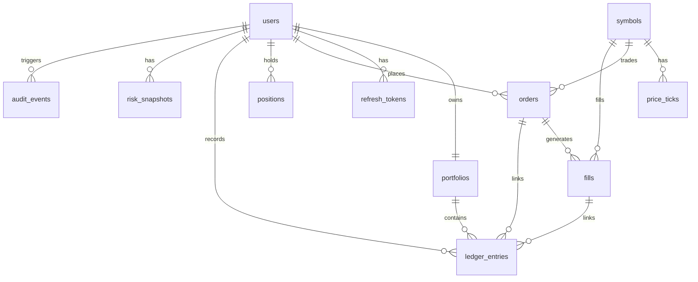

# Data Model

## Principles

- Use PostgreSQL with Flyway migrations.
- Use application-generated UUIDs. The initial schema does not define database-side UUID defaults.
- Use `NUMERIC` values mapped to `BigDecimal` for cash, prices, quantities, and P&L.
- Keep ledger entries append-only in normal operation.
- Add explicit constraints, foreign keys, and indexes.

## Tables

| Table | Purpose |
| --- | --- |
| `users` | Authenticated accounts and roles. |
| `refresh_tokens` | Hashed refresh tokens with expiry and revocation. |
| `symbols` | Supported tradable symbol metadata. |
| `price_ticks` | Historical normalized market ticks. |
| `portfolios` | User cash balance and base currency. |
| `orders` | User paper orders with idempotency keys and lifecycle status. |
| `fills` | Execution records for filled orders. |
| `positions` | Current user holdings and average cost. |
| `ledger_entries` | Append-only cash and position deltas. |
| `risk_snapshots` | Point-in-time portfolio risk metrics. |
| `audit_events` | Security and financial audit trail. |

## Relationships

- `users` owns `refresh_tokens`, `orders`, `positions`, `risk_snapshots`, and `audit_events`.
- `users` has exactly one `portfolios` row.
- `symbols` is referenced by `price_ticks`, `orders`, `fills`, `positions`, and symbol-linked `ledger_entries`.
- `orders` can have one or more `fills`.
- `fills` and `orders` can be referenced from `ledger_entries` for auditability.
- `ledger_entries` references `portfolios` so cash and position deltas can be reconciled against a portfolio.

## Key Constraints

- `orders(user_id, idempotency_key)` is unique to prevent duplicate user submissions.
- Order side, type, and status are constrained to explicit enum values.
- Market orders require a null `limit_price`; limit orders require a positive `limit_price`.
- Rejected orders must store a `rejection_reason`.
- `positions(user_id, symbol_id)` is unique.
- `price_ticks(symbol_id, ts, source)` is unique for deterministic replay data.
- Ledger entry types are constrained to known accounting actions.

## Seed Data

Flyway seeds deterministic symbol rows for `AAPL`, `MSFT`, `NVDA`, `TSLA`, and `SPY` using fixed UUIDs. Demo account seeding is handled by application code and is disabled by default; it only runs in `local` or `dev` profiles when `ledgerstream.demo-seed.enabled=true`.

## Indexes

- `price_ticks(symbol_id, ts DESC)` supports recent quote history lookups.
- `orders(user_id, created_at DESC)` supports user order history.
- `orders(symbol_id, status)` supports pending order evaluation by symbol.
- `ledger_entries(user_id, created_at DESC)` supports paginated user ledger views.
- `ledger_entries(order_id)` supports order-to-ledger reconciliation.
- `risk_snapshots(user_id, created_at DESC)` supports latest and historical risk views.
- `audit_events(user_id, created_at DESC)` and `audit_events(action, created_at DESC)` support security review queries.

## Transaction Boundaries

Fills, cash updates, position changes, and ledger entries must be written inside one database transaction. Duplicate order submissions with the same user-scoped idempotency key must not create duplicate orders or duplicate fills.

Order creation writes a `PENDING` `orders` row and publishes `order.created`. The service treats `(user_id, idempotency_key)` as the idempotency boundary: duplicate submissions return the existing order and do not write or publish again.

Market execution consumes `order.created` and handles fill creation, order status, cash settlement, position settlement, and ledger append in one Spring transaction.

## Order Lifecycle

The implemented order service supports `PENDING` creation and `PENDING -> CANCELLED` transitions. Attempts to cancel `FILLED`, `CANCELLED`, or `REJECTED` orders are rejected with a conflict response. Market execution owns `PENDING -> FILLED` and `PENDING -> REJECTED` transitions for market orders.

## Accounting Rules

- Cash balances, fees, cash deltas, and realized P&L use 2 decimal places with `HALF_UP` rounding.
- Prices, quantities, and average cost use 6 decimal places with `HALF_UP` rounding.
- BUY fills decrease cash by `price * quantity + fee`, increase position quantity, and recalculate weighted average cost from existing cost basis plus fill cost.
- SELL fills increase cash by `price * quantity - fee`, decrease position quantity, and add realized P&L as `(execution price - average cost) * quantity - fee`.
- Partial sells keep the existing average cost.
- Full sells keep the position row with `quantity = 0.000000` and `avg_cost = 0.000000`; a future cleanup or archival policy can hide closed positions from portfolio views.
- The current fee model is zero-fee, but the settlement formulas include the fill fee field so a later fee model can be introduced without changing the accounting shape.

## Portfolio Read Model

Portfolio API reads are user-scoped through the authenticated user ID:

- `portfolios` provides cash, base currency, and the portfolio timestamp.
- `positions` provides quantity, average cost, and realized P&L.
- latest quotes provide valuation price, market value, total equity, and unrealized P&L when available.
- `ledger_entries` provides paginated append-only cash and quantity deltas.

When a latest quote is unavailable for a position, the read model uses average cost as a valuation fallback. The position response marks this with `valuationSource = COST_BASIS_FALLBACK`, leaves `lastPrice` null, and reports zero unrealized P&L for that position. Latest-quote valuations use `valuationSource = LATEST_QUOTE`.

Ledger pages are zero-based and bounded to a maximum size of 100 entries to keep user-facing reads predictable.

## Risk Snapshot Formulas

`risk_snapshots` rows are generated after successful fills and after accepted market ticks for users with open positions in the ticked symbol. Each snapshot is point-in-time and append-only.

- `cash`: current portfolio cash rounded to 2 decimal places.
- `gross_exposure`: sum of absolute position market values, rounded to 2 decimal places.
- `total_equity`: cash plus net position market value, rounded to 2 decimal places.
- `largest_position_pct`: largest absolute position market value divided by total equity, multiplied by `100`, rounded to 4 decimal places. If total equity is zero or negative, the value is `0.0000`.
- `unrealized_pnl`: sum of `(latest price - avg_cost) * quantity`, rounded to 2 decimal places.

Risk valuation uses the latest quote `last` price when available. If no latest quote exists, the service uses average cost as a valuation fallback and contributes `0.00` unrealized P&L for that position.

## Append-Only Ledger

`ledger_entries` is modeled as an immutable accounting journal. Normal application code inserts ledger rows through `PortfolioLedgerService`, which exposes append behavior only and is called from the fill settlement transaction. Normal portfolio flows must not update or delete ledger rows.

Each filled market order currently creates one ledger entry:

- `BUY_FILL`: negative `cash_delta`, positive `quantity_delta`, execution price, and references to the user, portfolio, order, fill, and symbol.
- `SELL_FILL`: positive `cash_delta`, negative `quantity_delta`, execution price, and references to the user, portfolio, order, fill, and symbol.

The current zero-fee model stores fee metadata on the fill ledger row. If a nonzero fee model is added later, the platform can either keep net cash deltas on fill rows or add explicit `FEE` rows while preserving append-only history.

## Audit Events

`audit_events` stores security, financial, and admin control actions with a nullable user reference, action name, request ID, timestamp, and JSON metadata. Implemented actions include registration, login success and safe failure reasons, refresh-token rotation, logout, order creation, order cancellation, order rejection, and admin replay start or stop.

Audit metadata intentionally excludes passwords, access tokens, refresh tokens, API keys, and raw IP addresses. Order audit metadata stores operational values such as order ID, symbol, side, type, quantity, and safe rejection reason so support and security reviews can reconstruct important state transitions without exposing secrets.

## Persistence Mapping

The backend maps schema rows to JPA entities under `com.ledgerstream.domain.model` and repositories under `com.ledgerstream.domain.repository`.

- UUID primary keys are assigned by the application before insert.
- Money, prices, quantities, exposure, and P&L use `BigDecimal`.
- Role, order side, order type, order status, symbol asset type, and ledger entry type use Java enums stored as strings.
- JSONB metadata columns are mapped through Hibernate JSON support.
- Fast unit tests exclude database auto-configuration; repository integration tests will use the Testcontainers base in `PostgresRepositoryTestSupport` when Docker is available.

## ERD Placeholder

