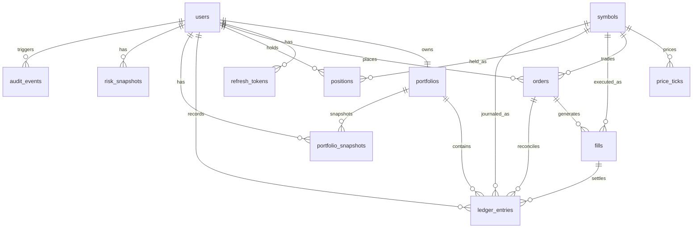
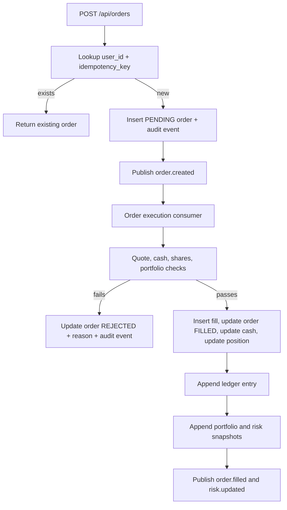

# Data Model

## Principles

- PostgreSQL is the durable source of truth; Flyway owns schema changes.
- Primary keys are application-generated UUIDs except `price_ticks.id`, which is a `BIGSERIAL` append key.
- Cash, prices, quantities, exposure, and P&L use `NUMERIC` in PostgreSQL and `BigDecimal` in Java.
- Financial mutations are user-scoped and enforced through foreign keys, repository predicates, and service authorization checks.
- Ledger, portfolio history, and risk history are append-only in normal operation.
- Schema constraints encode domain invariants instead of leaving them only in service code.

## Entity Relationship Diagram

## Table Catalog

| Table | Purpose | Important fields and invariants |
| --- | --- | --- |
| `users` | Authenticated accounts and roles. | Unique `email`; BCrypt `password_hash`; `role` constrained to `USER` or `ADMIN`; `updated_at >= created_at`. |
| `refresh_tokens` | Refresh-token rotation state. | `token_hash` is stored instead of raw token material; each row belongs to a user; `expires_at > created_at`; optional `revoked_at`. |
| `symbols` | Supported tradable instruments. | Unique uppercase `ticker`; `asset_type` constrained to `EQUITY` or `ETF`; active flag for future delisting or disablement behavior. |
| `price_ticks` | Historical normalized quote ticks. | `symbol_id`, timestamp, bid, ask, last, volume, and source; prices must be positive; volume must be non-negative; `(symbol_id, ts, source)` is unique for deterministic replay. |
| `portfolios` | User cash account. | One row per user; `cash_balance NUMERIC(18,2)`; non-negative cash; uppercase three-letter base currency. |
| `orders` | Paper order intent and lifecycle state. | User, symbol, side, order type, quantity, optional limit price, status, idempotency key, and rejection reason; quantity must be positive; rejected orders require a reason. |
| `fills` | Execution records for filled orders. | References order and symbol; price and quantity must be positive; fee is non-negative and defaults to zero. |
| `positions` | Current holdings per user and symbol. | Unique `(user_id, symbol_id)`; non-negative quantity and average cost; realized P&L accumulates on sells. |
| `ledger_entries` | Append-only accounting journal. | References user and portfolio, plus optional order, fill, and symbol; stores cash and quantity deltas, execution price, entry type, and JSONB metadata. |
| `portfolio_snapshots` | Point-in-time portfolio history read model. | Total equity, cash, market value, gross exposure, realized P&L, unrealized P&L, and timestamp; created after fills and accepted ticks for affected users. |
| `risk_snapshots` | Point-in-time risk read model. | Total equity, cash, gross exposure, largest position percent, unrealized P&L, and timestamp; created after fills and accepted ticks for affected users. |
| `audit_events` | Security, auth, financial, and admin audit trail. | Nullable user reference, action, request ID, optional `ip_hash`, user agent, timestamp, and safe JSONB metadata. |

## Relationships

- `users` has one `portfolios` row and owns refresh tokens, orders, positions, ledger entries, portfolio snapshots, risk snapshots, and audit events.
- `symbols` is the reference table for market data, orders, fills, positions, and symbol-linked ledger entries.
- `orders` can produce fills and can be linked to ledger entries for reconciliation.
- `fills` are the execution records that drive portfolio cash updates, position updates, ledger entries, portfolio snapshots, and risk snapshots.
- `ledger_entries` always belongs to a user and portfolio, and can link back to the order and fill that caused the accounting movement.
- `audit_events.user_id` is nullable so safe auth failures or system actions can still be recorded when a user is unknown.

## Constraints

| Constraint | Purpose |
| --- | --- |
| `users.email UNIQUE` | Prevent duplicate account identities. |
| `refresh_tokens.token_hash` index | Support refresh lookup without storing raw refresh tokens. |
| `symbols.ticker UNIQUE` and uppercase check | Keep ticker lookup deterministic. |
| `price_ticks(symbol_id, ts, source) UNIQUE` | Make replay ingestion idempotent for repeated fixture runs. |
| `portfolios.user_id UNIQUE` | Enforce one cash account per user. |
| `orders(user_id, idempotency_key) UNIQUE` | Prevent duplicate order submissions from creating duplicate orders or fills. |
| `orders` side/type/status checks | Keep lifecycle values inside known enum sets. |
| `orders` market/limit price check | Require null `limit_price` for market orders and positive `limit_price` for limit orders. |
| `orders` rejected-reason check | Ensure rejected orders preserve an explainable reason. |
| `positions(user_id, symbol_id) UNIQUE` | Keep one current holding row per user and symbol. |
| `ledger_entries.entry_type` check | Restrict ledger rows to known accounting actions. |

## Indexes

| Index | Query path |
| --- | --- |
| `idx_refresh_tokens_user_id` | User token management and logout cleanup paths. |
| `idx_refresh_tokens_token_hash` | Refresh-token lookup during rotation. |
| `idx_symbols_active_ticker` | Authenticated symbol list and active ticker lookups. |
| `idx_price_ticks_symbol_ts_desc` | Latest quote fallback and bounded quote history reads. |
| `uq_price_ticks_symbol_ts_source` | Deterministic tick replay idempotency. |
| `idx_orders_user_created_desc` | User-scoped order history. |
| `idx_orders_symbol_status` | Pending order evaluation by symbol for limit matching and diagnostics. |
| `idx_fills_order_id` | Order detail and reconciliation queries. |
| `idx_fills_symbol_filled_at` | Symbol execution history and diagnostics. |
| `uq_positions_user_symbol` | Current position lookup and settlement update. |
| `idx_ledger_entries_user_created_desc` | Paginated user ledger view. |
| `idx_ledger_entries_order_id` | Order-to-ledger reconciliation. |
| `idx_portfolio_snapshots_user_created_desc` | Historical portfolio equity chart and paginated history reads. |
| `idx_risk_snapshots_user_created_desc` | Latest and historical risk views. |
| `idx_audit_events_user_created_desc` | User audit review. |
| `idx_audit_events_action_created_desc` | Security and operational action review. |

## Seed Data

`V2__seed_symbols.sql` inserts deterministic rows for `AAPL`, `MSFT`, `NVDA`, `TSLA`, and `SPY` with fixed UUIDs. Demo account seeding is application-controlled, disabled by default, and only active in `local` or `dev` profiles when `ledgerstream.demo-seed.enabled=true`.

## Order And Settlement Boundaries

Order creation and execution are intentionally separate service flows. Submission records the user's order intent and publishes `order.created`. Execution reloads the stored order, verifies it is still `PENDING`, checks the latest executable quote, and then settles, rejects, or leaves a non-crossed limit order pending. Accepted market ticks also re-evaluate pending limit orders for the ticked symbol.

The order execution transaction includes order status, fill insertion, portfolio cash update, position update, ledger append, portfolio history snapshot creation, and risk snapshot creation. `PortfolioLedgerService.appendFill` uses mandatory transaction propagation, so ledger rows cannot be appended outside the settlement transaction.

Kafka event publishing is currently issued from service code and is not backed by a database outbox. The database transaction protects the financial state; an outbox is the next reliability step if event delivery must be recovered after process failure.

## Order Lifecycle

- `PENDING`: created by `POST /api/orders` after validation and idempotency lookup.
- `FILLED`: assigned by order execution after a fill is created and settlement completes.
- `REJECTED`: assigned by order execution when a market order has no quote, no positive executable price exists, the buyer has insufficient cash, the seller has insufficient shares, or the portfolio is missing.
- `CANCELLED`: assigned by the user cancellation endpoint while the order is still pending.

Attempts to cancel `FILLED`, `CANCELLED`, or `REJECTED` orders return a conflict. Limit orders stay `PENDING` while not crossed, can be cancelled while pending, and fill when a later quote crosses their limit.

## Accounting Rules

- Cash balances, fees, cash deltas, and realized P&L use 2 decimal places with `HALF_UP` rounding.
- Prices, quantities, and average cost use 6 decimal places with `HALF_UP` rounding.
- BUY fills decrease cash by `price * quantity + fee`, increase position quantity, and recalculate weighted average cost from existing cost basis plus fill cost.
- SELL fills increase cash by `price * quantity - fee`, decrease position quantity, and add realized P&L as `(execution price - average cost) * quantity - fee`.
- Partial sells keep the existing average cost.
- Full sells keep the position row with `quantity = 0.000000` and `avg_cost = 0.000000`; the API can hide or filter closed positions later without deleting history.
- The current fee model is zero-fee, but settlement formulas and fill metadata include fee so a later fee model can reuse the same accounting structure.

## Append-Only Ledger

`ledger_entries` is the accounting journal. Normal application code inserts ledger rows through `PortfolioLedgerService` and does not update or delete existing rows.

Each filled order currently creates one ledger row:

| Entry type | Cash delta | Quantity delta | Links |
| --- | ---: | ---: | --- |
| `BUY_FILL` | Negative total cost | Positive filled quantity | user, portfolio, order, fill, symbol |
| `SELL_FILL` | Positive proceeds after fee | Negative filled quantity | user, portfolio, order, fill, symbol |

The row carries execution price and JSONB metadata such as order side, order type, and fee. Future `FEE`, `REVERSAL`, or `ADJUSTMENT` rows can be appended without mutating older rows.

## Portfolio Read Model

Portfolio API reads are user-scoped through the authenticated user ID:

- `portfolios` provides cash, base currency, and update timestamp.
- `positions` provides quantity, average cost, and realized P&L.
- Latest quote data provides valuation price, market value, total equity, and unrealized P&L when available.
- `ledger_entries` provides zero-based paginated journal rows, bounded to a maximum page size of 100.
- `portfolio_snapshots` provides zero-based paginated equity, cash, exposure, and P&L history for the frontend equity chart.

When a latest quote is unavailable for a position, the read model uses average cost as the valuation fallback. The response marks this as `COST_BASIS_FALLBACK`, leaves `lastPrice` null, and reports zero unrealized P&L for that position. Latest-quote valuations use `LATEST_QUOTE`.

## Market Data Persistence

`market.tick` ingestion validates symbol, timestamp, bid, ask, last price, volume, and source. Accepted ticks resolve the symbol, insert a `price_ticks` row if `(symbol_id, ts, source)` has not already been seen, update the Redis latest quote cache, broadcast matching SSE subscribers, record portfolio and risk snapshots for users with open positions in that symbol, and re-check pending limit orders for that symbol.

Redis stores latest quotes under `latest_quote:{SYMBOL}`. No TTL is currently applied; quote freshness is determined from the embedded timestamp, and quote APIs fall back to PostgreSQL if Redis misses or read access fails.

## Portfolio Snapshot Formulas

`portfolio_snapshots` rows are point-in-time records created after successful fills and after accepted market ticks for users with open positions in the ticked symbol.

- `cash`: current portfolio cash rounded to 2 decimal places.
- `market_value`: sum of signed position market values rounded to 2 decimal places.
- `gross_exposure`: sum of absolute position market values rounded to 2 decimal places.
- `total_equity`: cash plus signed market value rounded to 2 decimal places.
- `realized_pnl`: sum of realized P&L on current position rows rounded to 2 decimal places.
- `unrealized_pnl`: sum of `(latest price - avg_cost) * quantity` rounded to 2 decimal places.

Portfolio history valuation uses the latest quote `last` price when available. If no latest quote exists, the service uses average cost and contributes `0.00` unrealized P&L for that position.

## Risk Snapshot Formulas

`risk_snapshots` rows are point-in-time records created after successful fills and after accepted market ticks for users with open positions in the ticked symbol.

- `cash`: current portfolio cash rounded to 2 decimal places.
- `gross_exposure`: sum of absolute position market values rounded to 2 decimal places.
- `total_equity`: cash plus net position market value rounded to 2 decimal places.
- `largest_position_pct`: largest absolute position market value divided by total equity, multiplied by `100`, and rounded to 4 decimal places. If total equity is zero or negative, the value is `0.0000`.
- `unrealized_pnl`: sum of `(latest price - avg_cost) * quantity` rounded to 2 decimal places.

Risk valuation uses the latest quote `last` price when available. If no latest quote exists, the service uses average cost and contributes `0.00` unrealized P&L for that position.

## Audit Events

`audit_events` stores auth, security, financial, and admin control actions with request ID and safe JSONB metadata. Implemented actions include registration, login success and safe failure reasons, refresh-token rotation, logout, order creation, order cancellation, order rejection, and admin replay start or stop.

Audit metadata excludes passwords, access tokens, refresh tokens, API keys, and raw IP addresses. Order audit metadata stores operational values such as order ID, symbol, side, type, quantity, and rejection reason so support and security review can reconstruct state transitions without exposing secrets.

## Persistence Mapping

The backend maps schema rows to JPA entities under `com.ledgerstream.domain.model` and repositories under `com.ledgerstream.domain.repository`.

- UUID primary keys are assigned by the application before insert.
- `BigDecimal` is used for money, prices, quantities, exposure, and P&L.
- Role, order side, order type, order status, symbol asset type, and ledger entry type use Java enums stored as strings.
- JSONB metadata columns are mapped through Hibernate JSON support.
- Fast unit tests exclude database auto-configuration; repository integration tests use Testcontainers support when Docker is available.
