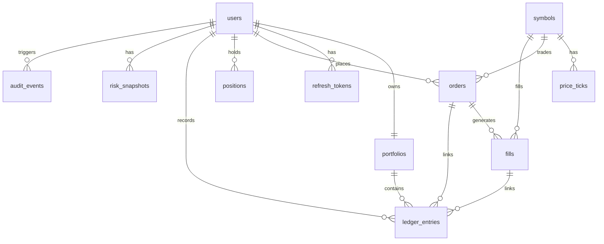

# Data Model

## Principles

- Use PostgreSQL with Flyway migrations.
- Use application-generated UUIDs. The initial schema does not define database-side UUID defaults.
- Use `NUMERIC` values mapped to `BigDecimal` for cash, prices, quantities, and P&L.
- Keep ledger entries append-only in normal operation.
- Add explicit constraints, foreign keys, and indexes.

## Tables

| Table | Purpose |
| --- | --- |
| `users` | Authenticated accounts and roles. |
| `refresh_tokens` | Hashed refresh tokens with expiry and revocation. |
| `symbols` | Supported tradable symbol metadata. |
| `price_ticks` | Historical normalized market ticks. |
| `portfolios` | User cash balance and base currency. |
| `orders` | User paper orders with idempotency keys and lifecycle status. |
| `fills` | Execution records for filled orders. |
| `positions` | Current user holdings and average cost. |
| `ledger_entries` | Append-only cash and position deltas. |
| `risk_snapshots` | Point-in-time portfolio risk metrics. |
| `audit_events` | Security and financial audit trail. |

## Relationships

- `users` owns `refresh_tokens`, `orders`, `positions`, `risk_snapshots`, and `audit_events`.
- `users` has exactly one `portfolios` row.
- `symbols` is referenced by `price_ticks`, `orders`, `fills`, `positions`, and symbol-linked `ledger_entries`.
- `orders` can have one or more `fills`.
- `fills` and `orders` can be referenced from `ledger_entries` for auditability.
- `ledger_entries` references `portfolios` so cash and position deltas can be reconciled against a portfolio.

## Key Constraints

- `orders(user_id, idempotency_key)` is unique to prevent duplicate user submissions.
- Order side, type, and status are constrained to explicit enum values.
- Market orders require a null `limit_price`; limit orders require a positive `limit_price`.
- Rejected orders must store a `rejection_reason`.
- `positions(user_id, symbol_id)` is unique.
- `price_ticks(symbol_id, ts, source)` is unique for deterministic replay data.
- Ledger entry types are constrained to known accounting actions.

## Indexes

- `price_ticks(symbol_id, ts DESC)` supports recent quote history lookups.
- `orders(user_id, created_at DESC)` supports user order history.
- `orders(symbol_id, status)` supports pending order evaluation by symbol.
- `ledger_entries(user_id, created_at DESC)` supports paginated user ledger views.
- `ledger_entries(order_id)` supports order-to-ledger reconciliation.
- `risk_snapshots(user_id, created_at DESC)` supports latest and historical risk views.
- `audit_events(user_id, created_at DESC)` and `audit_events(action, created_at DESC)` support security review queries.

## Transaction Boundaries

Fills, cash updates, position changes, and ledger entries must be written inside one database transaction. Duplicate order submissions with the same user-scoped idempotency key must not create duplicate orders or duplicate fills.

## Append-Only Ledger

`ledger_entries` is modeled as an immutable accounting journal. Normal application code must insert ledger entries but must not update or delete them. Later service and repository layers will enforce this by exposing write-only append operations and read-only query paths.

## Persistence Mapping

The backend maps schema rows to JPA entities under `com.ledgerstream.domain.model` and repositories under `com.ledgerstream.domain.repository`.

- UUID primary keys are assigned by the application before insert.
- Money, prices, quantities, exposure, and P&L use `BigDecimal`.
- Role, order side, order type, order status, symbol asset type, and ledger entry type use Java enums stored as strings.
- JSONB metadata columns are mapped through Hibernate JSON support.
- Fast unit tests exclude database auto-configuration; repository integration tests will use the Testcontainers base in `PostgresRepositoryTestSupport` when Docker is available.

## ERD Placeholder

## TODO

- Add rounding and precision rules.
