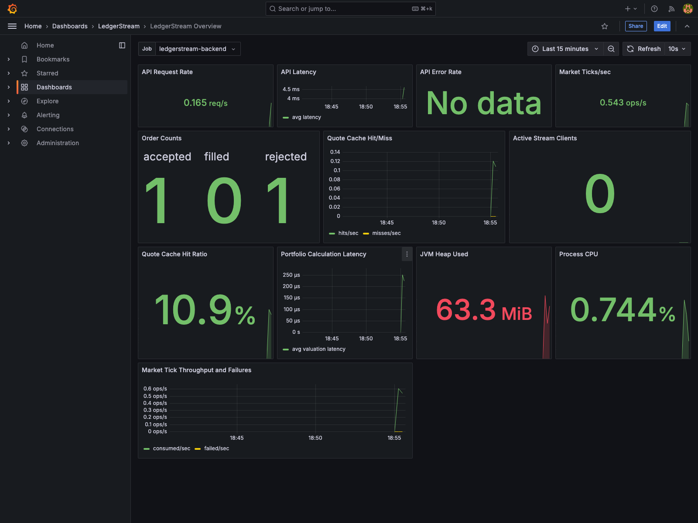

# Observability

## Goals

LedgerStream should be inspectable through health checks, structured logs, Prometheus metrics, and Grafana dashboards.

## Implemented Metrics

The backend exposes Prometheus metrics at `/actuator/prometheus`. The local Prometheus service scrapes `backend:8080/actuator/prometheus` through `infra/prometheus/prometheus.yml`.

Spring Boot and Micrometer provide JVM, process, HTTP server, datasource, and executor metrics. LedgerStream adds custom operational and business metrics:

- `ledgerstream_market_ticks_consumed_total`: accepted `market.tick` events applied to PostgreSQL and Redis. Duplicate historical rows are skipped, but the latest quote cache is still refreshed and the event is counted as consumed.
- `ledgerstream_market_ticks_failed_total`: malformed, unknown-symbol, or infrastructure-failed `market.tick` events.
- `ledgerstream_orders_total`: newly accepted paper orders.
- `ledgerstream_orders_filled_total`: paper orders filled by the execution engine.
- `ledgerstream_orders_rejected_total`: paper orders rejected by the execution engine.
- `ledgerstream_quote_stream_clients`: active SSE quote stream clients on the current backend instance.
- `ledgerstream_quote_stream_events_total`: quote SSE events sent by the backend.
- `ledgerstream_quote_stream_send_failures_total`: quote SSE send failures that caused the backend to close a stream.
- `ledgerstream_quote_cache_hits_total`: latest quote reads served from Redis.
- `ledgerstream_quote_cache_misses_total`: latest quote reads that fell back to PostgreSQL because Redis missed or was unavailable.
- `ledgerstream_event_consumer_retries_total`: Kafka listener retry attempts by source topic and exception.
- `ledgerstream_event_consumer_dead_letters_total`: Kafka listener records published to dead-letter topics by source topic, target topic, and exception.
- `ledgerstream_portfolio_calculation_latency`: timer for portfolio summary and position valuation calculations. Prometheus exports timer series such as `_seconds_count`, `_seconds_sum`, and `_seconds_max`.

Planned custom metrics:

- Orders cancelled.
- Risk calculation latency.
- API-level business error counts by endpoint and reason.

## Health Checks

Spring Boot Actuator exposes `/actuator/health`. With Redis auto-configuration enabled, the backend reports Redis connectivity as part of health in local and deployed profiles. The test profile disables Redis health checks so unit and MVC tests do not require a running Redis server.

The Compose Redis service also has a container health check based on `redis-cli ping`.

## Local Observability Capture

On June 28, 2026, the observability stack was run locally with an isolated Compose project and alternate host ports. The run generated traffic by replaying `workers/market-data/data/sample_ticks.csv`, registering a temporary user, reading quote and portfolio APIs, and submitting one AAPL market BUY order from an account with no cash. The order was accepted by the API and then rejected by the execution consumer with `Insufficient cash`.

Prometheus scrape verification after the run:

| Signal | Observed value |
| --- | ---: |
| `ledgerstream_market_ticks_consumed_total` | `25` |
| `ledgerstream_market_ticks_failed_total` | `0` |
| `ledgerstream_orders_total` | `1` |
| `ledgerstream_orders_filled_total` | `0` |
| `ledgerstream_orders_rejected_total` | `1` |
| `ledgerstream_quote_cache_hits_total` | `5` |
| `ledgerstream_quote_cache_misses_total` | `0` |

These values are from a single local screenshot-generation run and are not performance claims.

## Grafana

Grafana is provisioned from files under `infra/grafana/provisioning`:

- `datasources/prometheus.yml` registers the Compose Prometheus service as the default Grafana datasource.
- `dashboards/ledgerstream.yml` registers the dashboard provider.
- `dashboards/ledgerstream-overview.json` defines the `LedgerStream Overview` dashboard.

The overview dashboard includes panels for:

- API request rate.
- API latency.
- API error rate.
- Market ticks/sec.
- Order filled/rejected counts.
- Quote cache hit/miss rate.
- Active stream clients.
- Quote cache hit ratio.
- Portfolio calculation latency.
- JVM heap used.
- Process CPU.
- Market tick throughput and failures.

Run the local observability stack with:

```bash
docker compose up -d prometheus grafana backend
```

Then open Grafana at `http://localhost:3000`, sign in with the local credentials from Compose, and open `Dashboards > LedgerStream > LedgerStream Overview`.

Captured dashboard screenshot:



## Backend Logs

Backend logs use Spring Boot structured JSON logging in the local profile through `logging.structured.format.console=logstash`. Request IDs are stored in MDC as `requestId` and echoed in the `X-Request-ID` header.

The structured logging format can be changed with `BACKEND_LOG_FORMAT`. Supported Spring Boot structured formats include `logstash`, `ecs`, and `gelf`.

Each completed HTTP request writes one request log entry with safe routing and timing fields:

- `requestId`
- `httpMethod`
- `httpPath`
- `endpoint`
- `httpStatus`
- `latencyMs`

Order lifecycle logs add scoped domain context where it is safe:

- `userId`
- `orderId`
- `symbol`
- `eventType`

Market tick rejection logs include `eventType=market.tick` and the submitted `symbol` when one is available.

Request logs intentionally do not include request bodies, query strings, authorization headers, cookies, passwords, access tokens, refresh tokens, API keys, or raw client IP addresses.

Example request log:

```json
{
  "@timestamp": "2026-06-28T16:21:33.102Z",
  "level": "INFO",
  "logger_name": "com.ledgerstream.web.RequestLoggingFilter",
  "message": "http_request completed",
  "requestId": "request-123",
  "httpMethod": "POST",
  "httpPath": "/api/orders",
  "endpoint": "/api/orders",
  "httpStatus": "201",
  "latencyMs": "42"
}
```

Example order lifecycle log:

```json
{
  "@timestamp": "2026-06-28T16:21:33.128Z",
  "level": "INFO",
  "logger_name": "com.ledgerstream.orders.OrderExecutionService",
  "message": "order_filled",
  "requestId": "request-123",
  "userId": "00000000-0000-0000-0000-000000000101",
  "orderId": "00000000-0000-0000-0000-000000000301",
  "symbol": "AAPL",
  "eventType": "order.filled"
}
```

Example failed-order lifecycle log:

```json
{
  "@timestamp": "2026-06-28T22:46:23.831Z",
  "level": "INFO",
  "logger_name": "com.ledgerstream.orders.OrderExecutionService",
  "message": "order_rejected reason=Insufficient cash",
  "userId": "00000000-0000-0000-0000-000000000101",
  "orderId": "00000000-0000-0000-0000-000000000301",
  "symbol": "AAPL",
  "eventType": "order.rejected"
}
```

## Debugging A Failed Order

1. Start with the API response or order history row and capture the `orderId`, status, and `rejectionReason`.
2. Search backend logs by `orderId`:

```bash
docker compose logs backend | rg '<order-id>|order_rejected|order_created'
```

3. Confirm the order was accepted by the API:

```bash
docker compose logs backend | rg 'httpPath":"/api/orders"|order_created'
```

4. Check whether the execution consumer processed the corresponding `order.created` event:

```bash
docker compose exec redpanda rpk group describe ledgerstream-backend
```

5. If the reason is quote-related, inspect market tick ingestion and quote cache metrics:

```bash
curl -s http://localhost:8080/actuator/prometheus | rg 'ledgerstream_market_ticks|ledgerstream_quote_cache'
```

6. If the reason is cash or share related, inspect the user portfolio, positions, and ledger APIs with the same authenticated user. Missing or cross-user resources intentionally return `404`.

Useful signals:

- `ledgerstream_orders_rejected_total` increments after execution rejects an order.
- `ledgerstream_market_ticks_consumed_total` should be greater than zero if replay has produced ticks.
- `ledgerstream_quote_cache_hits_total` should increase when latest quotes are served from Redis.
- `ledgerstream_quote_cache_misses_total` indicates PostgreSQL fallback or stale/missing cache state.

## Inspecting Queue And Event Lag

List topics:

```bash
docker compose exec redpanda rpk topic list
```

Expected local topics after replay/order traffic include `market.tick` and `order.created`; other topics are created when their publishers run.

Dead-letter topics use the source topic plus the configured suffix, `.DLT` by default. The current backend listener configuration publishes malformed or exhausted consumer records to:

- `market.tick.DLT`
- `order.created.DLT`

Admin users can also inspect the configured source topics, dead-letter topics, and retry policy through:

```bash
curl -s http://localhost:8080/api/admin/queue-health \
  -H "Authorization: Bearer $ADMIN_TOKEN"
```

Inspect backend consumer group lag:

```bash
docker compose exec redpanda rpk group describe ledgerstream-backend
```

Example from the June 28, 2026 observability run:

```text
GROUP        ledgerstream-backend
STATE        Stable
TOTAL-LAG    0

TOPIC          PARTITION  CURRENT-OFFSET  LOG-END-OFFSET  LAG
market.tick    0          25              25              0
order.created  0          1               1               0
```

When lag is non-zero, check backend consumer logs, Kafka connectivity settings, and malformed-event metrics. If `market.tick` lag grows, quotes and risk snapshots can go stale. If `order.created` lag grows, submitted orders can remain `PENDING` longer than expected.

Inspect dead-lettered records:

```bash
docker compose exec redpanda rpk topic consume market.tick.DLT --num 5
docker compose exec redpanda rpk topic consume order.created.DLT --num 5
```

Useful retry and DLT metrics:

```bash
curl -s http://localhost:8080/actuator/prometheus | rg 'ledgerstream_event_consumer_(retries|dead_letters)'
```

Retry policy defaults are `BACKEND_KAFKA_RETRY_MAX_ATTEMPTS=3`, `BACKEND_KAFKA_RETRY_BACKOFF=2s`, and `BACKEND_KAFKA_DEAD_LETTER_SUFFIX=.DLT`. Invalid market ticks are classified as non-retryable and go straight to DLT; unexpected infrastructure or listener failures retry first.

## TODO

- Add a stream-disconnect troubleshooting playbook after SSE load testing is added.
